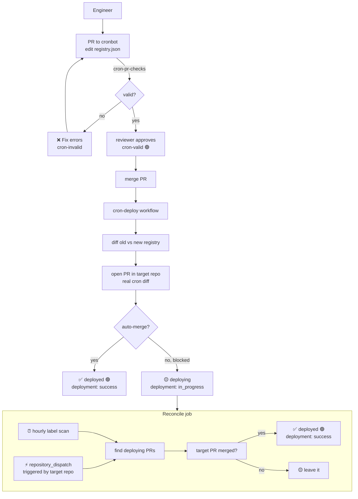
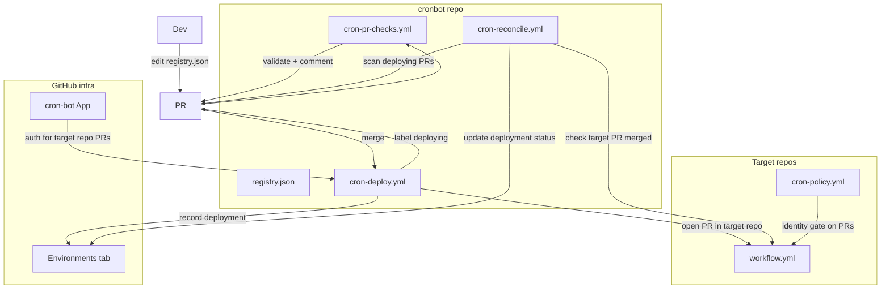

<div align="center">

# cronbot

**Make GitHub Actions crons durable, watched, and managed.**

Crons die when their owner leaves. cronbot fixes that.

[](https://go.dev)
[]()
[]()

</div>

---

## The problem

GitHub Actions crons have a hidden flaw:

- The "owner" is just **whoever merged the last change**
- That person leaves the company
- The cron goes quiet
- **No one is told**
- No owner. No alert. No health check.

```
  person leaves  →  cron goes quiet  →  nobody notices  →  something breaks
```

This has happened at every company with GHA crons.

---

## The fix

**Only a bot can change a cron. The bot never leaves.**

Cron changes go through **pull requests** — the same flow engineers already know.

```
  PR to cronbot (edit registry.json)
    ├── checks validate the change
    ├── reviewer approves
    └── merge triggers deploy

  Deploy:
    ├── bot opens PR in target repo (real cron diff)
    ├── bot auto-merges it
    └── cron is now owned by cron-bot[bot]
```

---

## How it works

### Add or update a cron

1. **Open a PR to cronbot** that edits `registry.json`
   - Add an entry: repo, path, cron expression, owner team

2. **Checks run automatically**
   - `cronbot --validate-registry` validates the JSON
   - Bot comments the deploy plan on the PR

3. **Reviewer approves and merges**
   - The merge IS the approval — no custom gate

4. **Deploy fires**
   - Bot opens a PR in the target repo
   - Bot auto-merges it (squash)
   - Cron is now owned by `cron-bot[bot]`

### Remove a cron

1. **Open a PR to cronbot** that removes the entry from `registry.json`
2. Same checks, same merge
3. Deploy opens a PR in the target repo that **deletes the schedule**
4. Bot auto-merges it

---

## See it live

### PR checks

When you open a PR that edits `registry.json`, the bot validates and comments:

```
 ┌──────────────────────────────────────────────────┐
 │ 🏷️  cron-valid 🟢                                 │
 ├──────────────────────────────────────────────────┤
 │ 💬 github-actions bot commented                   │
 │                                                   │
 │  ## ✅ Registry is valid                          │
 │                                                   │
 │  ## 📋 Deploy Plan                               │
 │                                                   │
 │  ### ➕ Added                                     │
 │  - octo-org/foo :: .github/workflows/nightly.yml  │
 │    → cron: 0 9 * * *                             │
 │                                                   │
 │  Merge this PR to deploy. The cron-bot App will   │
 │  open a PR in each target repo.                   │
 └──────────────────────────────────────────────────┘
```

### Deploy status

After merge, the PR gets a label:

```
  ✅ Happy path:
     deployed 🟢   → bot auto-merged the target PR

  🟡 Deploy in progress:
     deploying 🟡  → target PR is open (blocked by checks/protection)
     → reconcile job checks hourly
     → or target repo triggers webhook mode

  ❌ Failed:
     deploy-failed 🔴 → target PR was closed without merging
```

### Deployments tab

Check the **Environments** tab on the cronbot repo for deployment history:

```
  cron-deploy
  ├── #42  octo-org/foo  ✅ success    2m ago
  ├── #43  octo-org/bar  🟡 in_progress 1h ago  (target PR open)
  └── #44  acme/web       ❌ failure     5h ago
```

---

## The flow



---

## The registry

One JSON file. Source of truth for every managed cron.

```json
[
  {
    "repo": "octo-org/foo",
    "path": ".github/workflows/nightly.yml",
    "cron_expression": "0 9 * * *",
    "owner_team": "cron-reviewers",
    "request": "https://github.com/.../pull/42"
  }
]
```

Edit it in a PR. The checks validate it. The merge deploys it.

---

## Reconcile: two modes

The reconcile job checks `deploying` PRs and completes them when the target PR merges.

### No-webhook mode (default)

Runs **hourly** on a schedule. Scans merged PRs with the `deploying` label.
For each, checks the target repo's deploy PR. No setup needed.

### Webhook mode (instant)

Target repos trigger the reconcile instantly when their PR merges:

```bash
gh api repos/stefanpenner-cs/cronbot/dispatches \
  --method POST \
  -f event_type=cron-deploy-check \
  -f client_payload='{"target_repo":"octo-org/foo","target_pr":15}'
```

This gives **webhook-speed resolution** without a webhook server. The target
repo just needs a workflow that calls this on PR merge.

### Manual mode

Trigger the reconcile manually from the Actions tab:

1. Go to **Actions** → **cron-reconcile**
2. Click **Run workflow**
3. Optionally enter a PR number to check just one

---

## Retry on failure

### Deploy PR creation fails

Re-run the **cron-deploy** workflow from the Actions tab. Nothing to fix —
it's transient (network, permissions, App not installed).

### Deploy PR blocked (can't auto-merge)

The target PR stays open. **Go fix it:**

1. Click the link in the deployment record (Environments tab)
2. Resolve whatever blocked it (conflicts, required checks, review)
3. Merge the PR yourself

The reconcile detects the merge and marks the deployment complete.

### Deploy PR closed without merging

The deployment is marked `failure`. The cronbot PR gets `deploy-failed`.
Reopen or recreate the target PR, then trigger reconcile.

---

## Quick start

From the repo root:

```bash
# run all tests
go test ./...

# validate a registry file
go run ./cmd/cronbot --validate-registry registry.json

# find crons that went quiet
go run ./cmd/deadman

# plan to re-home fragile crons (dry-run)
go run ./cmd/rehome

# check a PR for unauthorized cron changes
go run ./cmd/cronguard --actor "$PR_AUTHOR" --base origin/main path/to/workflow.yml

# lint all workflow files for unregistered crons
go run ./cmd/cronlint --dir .
```

---

## Architecture



---

## Tool reference

### cronbot

The brain. Validates registry, builds plans.

```bash
# validate registry
cronbot --validate-registry registry.json

# validate a cron request (issue-based, legacy)
cronbot --issue-body issue.md --request-url URL --registry registry.json

# removal
cronbot --remove --issue-body issue.md --request-url URL --registry registry.json
```

### cronguard

The identity gate. Blocks human cron changes in PRs.

```bash
cronguard --actor "$PR_AUTHOR" --base origin/main \
  .github/workflows/foo.yml .github/workflows/bar.yml
```

### cronlint

The prevention lint. Every cron must be registered.

```bash
cronlint --dir . --registry cron-registry.txt
cronlint --ban-all --allow 'vendor/**' --dir .
cronlint --list-touched --dir .
```

### deadman

Find crons that went quiet.

```bash
go run ./cmd/deadman
go run ./cmd/deadman --all --json-out report.json
```

### rehome

Plan to move fragile crons onto a bot account.

```bash
go run ./cmd/rehome
go run ./cmd/rehome --json-out plan.json
```

---

## Setup

### For the PR + deploy flow

1. **Create the cron-bot GitHub App** (or use a PAT)
   - App needs: `contents:write`, `pull_requests:write` on target repos
   - Install org-wide (or per target repo)
   - Store `CRON_APP_ID` (variable) + `CRON_APP_KEY` (secret)
   - Or store a PAT as `DEPLOY_TOKEN`

2. **That's it.** Open a PR editing `registry.json` and watch it work.

Without a token, the checks still run (they use the default `GITHUB_TOKEN`).
The deploy step will comment that a token is needed.

### For the identity gate (target repos)

See **[ci/README.md](ci/README.md)** for:

- Org ruleset setup
- Required workflow registration
- Enterprise rollout

---

## FAQ

**Why PRs instead of issues?**

Engineers already know PRs. The PR gives you:
- Real diffs (you see the actual registry change)
- Native checks (red/green status)
- Native review (Approve button)
- Merge = approval (no custom gate)
- Deployment records (Environments tab)

**What if a target repo's merge is blocked?**

The deploy PR stays open. You go fix it (resolve conflicts, satisfy checks).
The reconcile job detects the merge and completes the deployment.

**Why two reconcile modes?**

Webhook mode is instant (target repo triggers reconcile on PR merge).
Scheduled mode is the fallback (hourly scan, no target-repo setup needed).
Both do the same thing.

**Can I use this without the App?**

Yes. The PR checks work with the default `GITHUB_TOKEN`. Only the deploy
step (opening PRs in OTHER repos) needs a cross-repo token.

**How is the registry kept safe?**

It's a PR. Branch protection, required reviews, status checks — all the
normal GitHub machinery applies. The merge IS the approval.

---

## Design choices

- **PRs are the entry point** — engineers know PRs, not custom issue flows
- **Merge = approval** — no custom environment gate, no "provision" job
- **Deploy is a real PR** — visible in the target repo, real diff
- **Deployments API** — native GitHub UI for deploy status
- **Reconcile is self-contained** — label scan + optional webhook
- **Owning team is fixed** (`cron-reviewers`), not a field
- **Cadence is read from the cron value**, not stored twice

---

## License

MIT