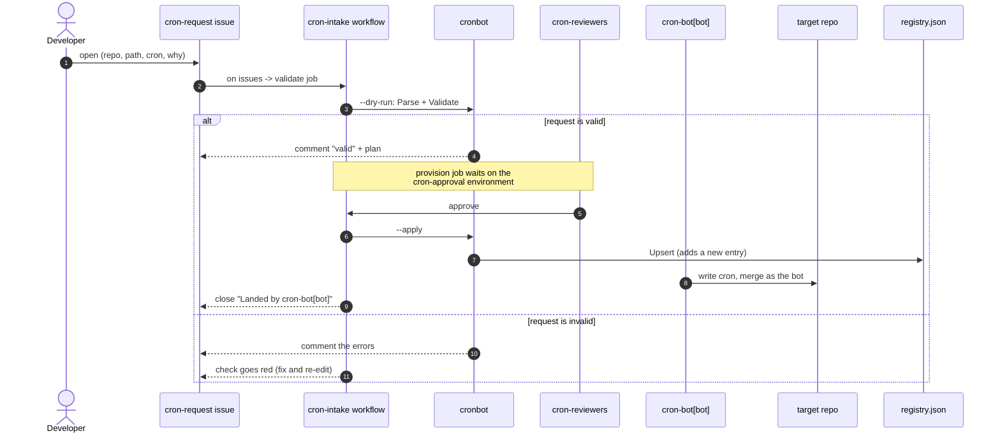
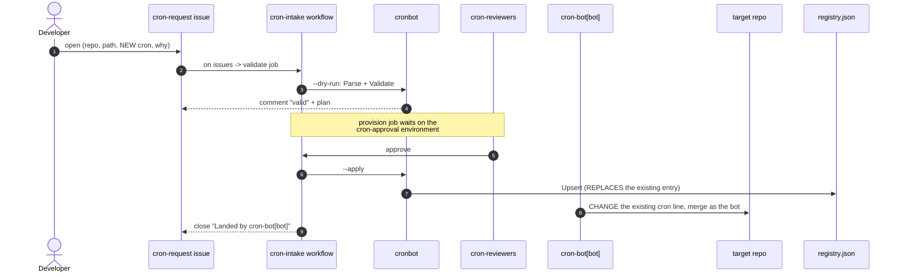
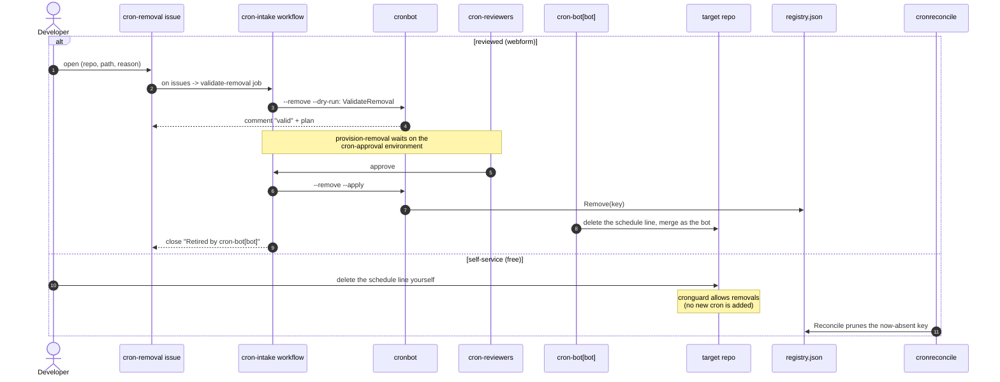

# cron-policy

Make GitHub Actions crons durable, watched, and managed.

## The problem

- A cron's "actor" is just the last person to merge a cron change.
- That person leaves. The cron goes quiet. No one is told.
- No owner. No alert. No health check.

## The fix: five small Go tools

- `rehome` — move a cron onto a durable bot account, without changing when it runs.
- `deadman` — find crons that have gone quiet, and alert.
- `cronguard` — block any human cron change. Only `cron-bot[bot]` may merge one.
- `cronbot` — turn a cron-request issue into a safe, registered plan.
- `cronreconcile` — de-register crons that were deleted, so the catalog stays honest.

All dry-run or check-only. Nothing here writes to your repos on its own.

## How a cron gets added

1. You file a `cron-request` issue.
2. The bot checks it and comments back.
3. The crew signs off.
4. `cron-bot[bot]` lands it. Now the bot owns it. It is durable.

A human who edits a cron directly is stopped by `cronguard` and sent here.

## How a cron gets removed

Removing a cron is safe — once the schedule is gone, nothing runs. So there are
two ways:

- Self-service (fast): delete the `schedule:` cron from the workflow yourself.
  `cronguard` allows removals. `cronreconcile` then drops it from the registry.
- Webform (reviewed): file a `cron-removal` issue. Stopping a job is a real
  change, so the same crew signs off, then `cron-bot[bot]` deletes the schedule
  and de-registers it.

So adds are always gated; removes can be free (self-service) or reviewed (form).

## Sequence diagrams

How a request flows from issue to durable cron. Same form, same jobs for add and
update; remove has its own form plus a free self-service path.

### Add



### Update

Same form and jobs as add. Only two things differ, marked below.



### Remove

Two paths. The reviewed webform, or a free self-service delete.




## See it live

Prototype: https://github.com/stefanpenner-cs/cron-policy

- Issue #1 (good): the bot says "valid" and shows the plan.
- Issue #2 (bad): the check goes red and the bot lists the errors.

## Run it

From the repo root:

```
go test ./...                 # all tests
go run ./cmd/deadman          # quiet-cron report
go run ./cmd/rehome           # re-home plan (dry-run)
go run ./cmd/cronbot --issue-body issue.md --request-url URL
go run ./cmd/cronguard --actor "$PR_AUTHOR" --base origin/main path/to/workflow.yml
go run ./cmd/cronreconcile --registry registry.json --crons crons.json --dry-run
```

## More

- `ci/README.md` — how to roll this out across an org or the whole enterprise.
- Owning team is fixed (`cron-reviewers`), not a form field.
- Cadence is read from the cron value, so it is not stored twice.
