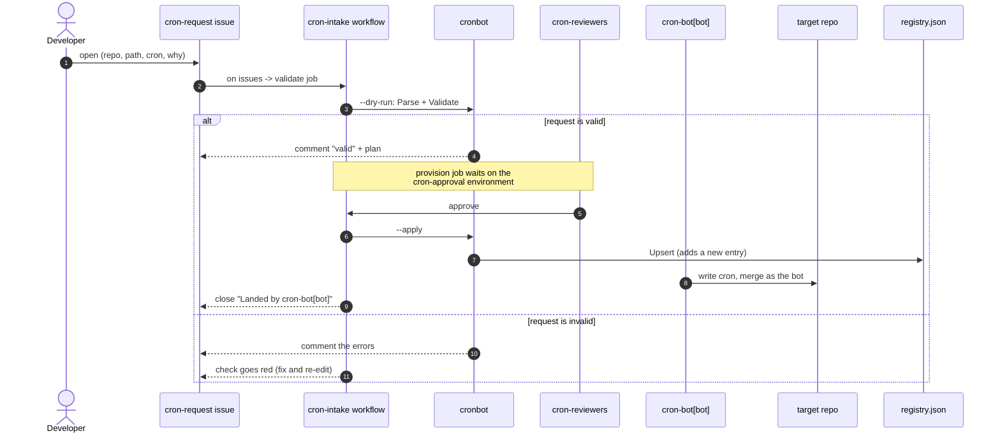
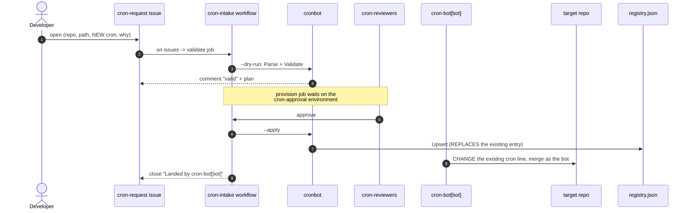
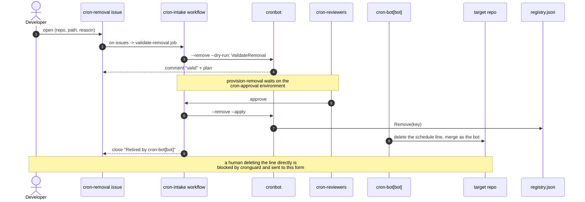

# cronbot

Make GitHub Actions crons durable, watched, and managed.

## The problem

- A cron's "actor" is just the last person to merge a cron change.
- That person leaves. The cron goes quiet. No one is told.
- No owner. No alert. No health check.

## The fix: four small Go tools

- `rehome` — move a cron onto a durable bot account, without changing when it runs.
- `deadman` — find crons that have gone quiet, and alert.
- `cronguard` — block any human cron change (add, edit, or remove). Only `cron-bot[bot]` may merge one.
- `cronbot` — turn a cron-request issue into a safe, registered plan.

All dry-run or check-only. Nothing here writes to your repos on its own.

## How a cron gets added

1. You file a `cron-request` issue.
2. The bot checks it and comments back.
3. The crew signs off.
4. `cron-bot[bot]` lands it. Now the bot owns it. It is durable.

A human who adds, edits, or deletes a cron directly is stopped by `cronguard`
and sent here.

## How a cron gets removed

There is one way: file a `cron-removal` issue. `cronguard` blocks you from
deleting a managed cron yourself, so removal goes through the same gate as adds.
Stopping a job is a real change, so the crew signs off, then `cron-bot[bot]`
deletes the schedule and de-registers it.

Because every change — add, edit, or remove — goes through the bot, the registry
never drifts from what is really running.

## Sequence diagrams

How a request flows from issue to durable cron. Same form, same jobs for add and
update; remove has its own form. Every path goes through `cron-bot[bot]`.

### Add



### Update

Same form and jobs as add. Only two things differ, marked below.



### Remove

One gated path: the `cron-removal` webform. `cronguard` blocks a human from
deleting a managed cron, so only the bot retires it.




## See it live

Prototype: https://github.com/stefanpenner-cs/cronbot

- Issue #1 (good): the bot says "valid" and shows the plan.
- Issue #2 (bad): the check goes red and the bot lists the errors.

## Run it

From the repo root:

```
go test ./...                 # all tests
go run ./cmd/deadman          # quiet-cron report
go run ./cmd/rehome           # re-home plan (dry-run)
go run ./cmd/cronbot --issue-body issue.md --request-url URL
go run ./cmd/cronguard --actor "$PR_AUTHOR" --base origin/main path/to/workflow.yml
```

## More

- `ci/README.md` — how to roll this out across an org or the whole enterprise.
- Owning team is fixed (`cron-reviewers`), not a form field.
- Cadence is read from the cron value, so it is not stored twice.
